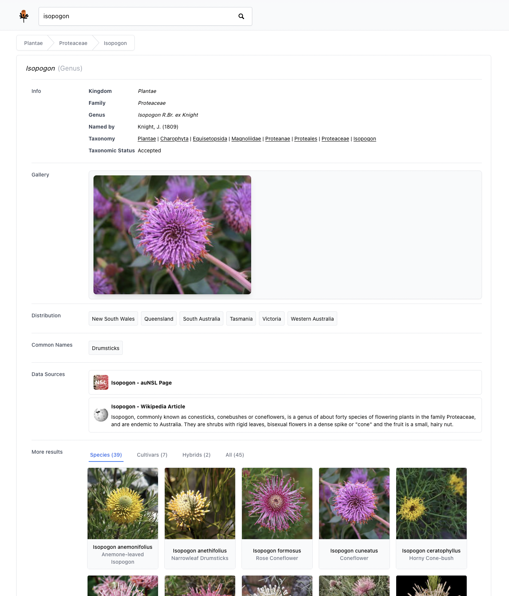
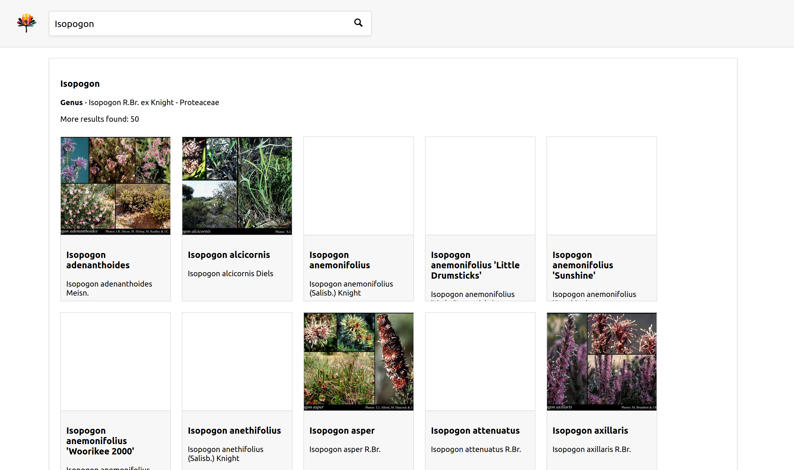

# Australian Flora Search

**NOTICE**: This is a hobby website - information and images may be inaccurate

A search engine and data aggregator for Australian native plants. The goal isn't to be an original source of information, but to link out to other more authoritative sources and provide user-friendly searching and discoverability.

# Screenshot

Previous Version

 

# Todo List:

-   Fine-grained distribution data
-   Allow filtering search results by various fields including distribution
-   For genuses and higher taxa, filter out images of non-Australian species
-   Ensure copyright compliance (e.g. Florabase images may need to be removed)
-   Add content to homepage, including featured taxa, popular searches, etc.

# Data sources

The main data source is the APNI and APC exports retrieved from https://biodiversity.org.au

Additionally, images and descriptions are fetched from other sources including Wikipedia and Florabase (WA plants).

Additional sources may be added in the future, including:

-   Atlas of Living Australia: https://bie.ala.org.au/species/https://id.biodiversity.org.au/taxon/apni/51270591
    -   ALA Flora of Australia: https://profiles.ala.org.au/opus/foa/search
-   APNI on ANBG website: https://www.anbg.gov.au/apni/apni.html
-   Aus Plants: https://austplants.com.au/plant-database
-   DNA: https://www.ncbi.nlm.nih.gov/nuccore/363990557
-   JSTOR: https://plants.jstor.org/search?genus=Isopogon&species=anemonifolius
-   KEW: http://apps.kew.org/herbcat/getHomePageResults.do?homePageSearchText=Isopogon+anemonifolius
-   Grin Global Taxonomy: https://npgsweb.ars-grin.gov/gringlobal/taxon/taxonomydetail?id=454051
-   Many others to consider...

# Tech stack

The frontend was built with React, Create-React-App and Tailwind. Because it has minimal state, no state management library was used (e.g. Redux, unstated, contexts, etc.).

The backend is a NodeJS server using express.js. The backend currently creates in-memory maps from various CSV and JSON files, instead of using a proper SQL database. This was a fast way to get it up and running to test the frontend, but is not efficient or extensible, so will be refactored at some point.
